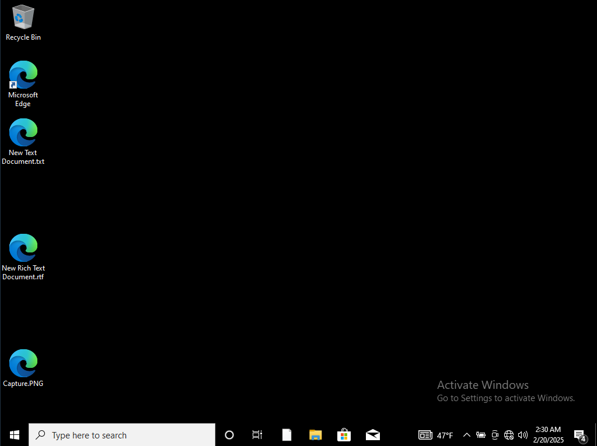
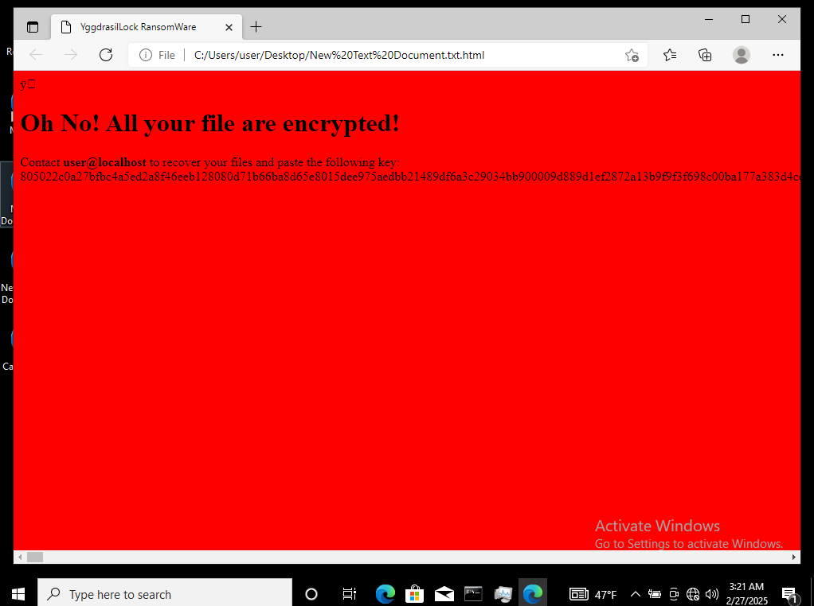
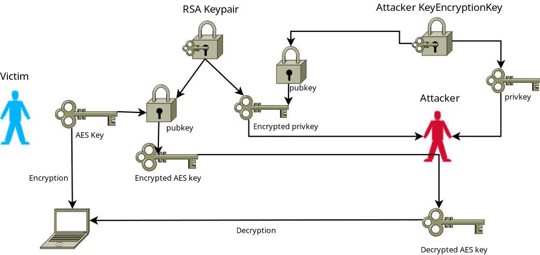

# Overview

FenrirLock is an IOC-less ransomware demonstrator. Please read DISCLAIMER.TXT before using it.

Typically, ransomware leaves numerous IOCs on the victim's computer, such as changing file extensions, dropping decryption information in a separate file, displaying a decryption instruction message, or establishing persistence. This demonstrator embeds the decryption message directly into the encrypted files to minimize the number of IOCs.



Clicking on any encrypted file will display the decryption instructions—the encrypted file itself serves as the decryption instruction!



Each file is encrypted using a unique AES key. These keys are then encrypted with an RSA public key that was generated before the encryption process. The private part of this RSA key is itself encrypted using the attacker's public key.




# Workspace initialization

## Generate PKI

The attacker must generate a keypair to be able to decrypt the ransom

```bash
go run main -genkeys
```

## Configure

Edit `conf.yaml` to set the email address to ask for the ransom (Do not forget, for educational purposes only!).

## build

To generate Windows x86_64, Linux ELF x86_64, and Linux ELF ARM64 executables, run:

```bash
make
```

Alternatively, you can use: `docker compose up`

## Usage

## To encrypt

Run the main without any argument or execute one of the binaries in `build`:

```bash
go run main.go
```

## Decrypt the victim private key

The victim, by following the instruction, should send a hex string to the attacker. The attacker can Decrypt the private key in PEM format by executing the following command:

```bash
go run main.go -recover_key <encrypted key hex string>
```

## Decrypt the victim files

To decrypt all files on the compromised machine, execute the following command using the private key obtained in the previous step.

```bash
go run main.go -decrypt privkey.pem
```
